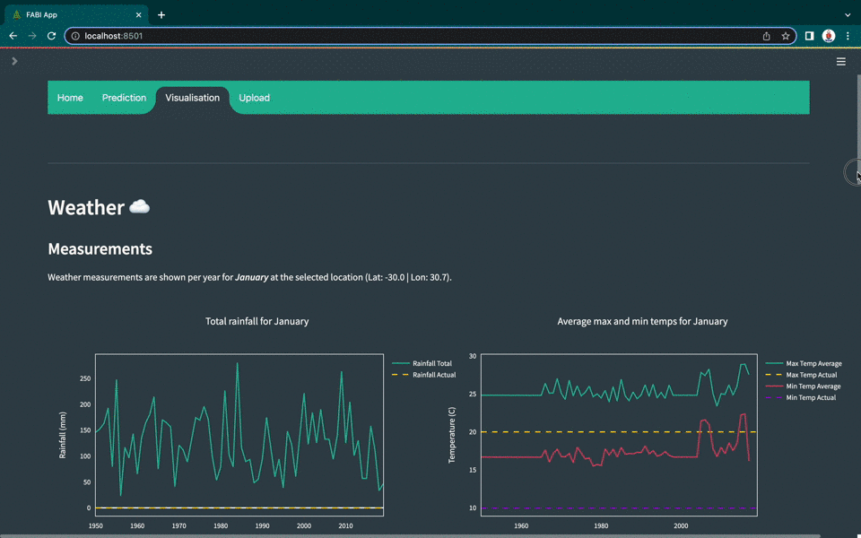
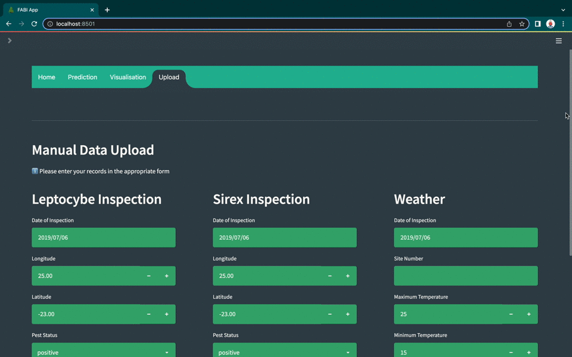

# Group 13: Weather-based Disease Management in South African Forests
*This project was done in partnership with the Forestry and Agricultural Biotechnology Institute (FABI) and serves to predict pest presence in South African Forests with machine learning classifiers.*

## Authors/Contributors:
- Gené Fourie: u20797274@tuks.co.za
- Connor McDonald: u16040725@tuks.co.za

## Project Description: 
South African Forests are currently under threat due to two species of invasive pests, namely: Sirex noctilio and Leptocybe invasa. These pests can severely stunt the growth of trees and even kill them. In this project we aim to utilise machine learning techniques to identify correlations between changing climatic patterns and pest presence in South African forests. We make use of two supervised classifiers, the Support Vector Machine, and XGBoost algorithms to make a binary prediction of pest presence. We were provided with the three datasets listed below:


1. Temperature and rainfall records of roughly 6000 weather stations across South Africa
2. Sirex noctilio (Sirex) pest inspection samples
3. Leptocybe invasa (Leptocybe) pest inspection samples


## Project Value:
- Model predictions are extrapolated across South Africa, allowing researchers to make predictions for inaccessible regions or regions with no data.
- Weather patterns that lead to positive pest presence can be directly compared to average or typical conditions to aid in the understanding of what may cause pest infestations.
- The user of the application has the option to download all the reports created leading up to the development of the application. This provides some academic perspective to the challenges faced when building this application


## How to install: 

*To clone the repository, copy the following command and run it in a terminal of your choice*
```
git clone https://github.com/up-mitc-ds/mit808-2022-project-significant-outliers-1.git
```

*To install the necessary packages, copy the following command and run it in a terminal of your choice*
```
pip install -r requirements.txt
```

## How to use the application: 

This application was built using the open source streamlit package for python web development. It is a multipage application where each page is essentially its own app. The app is constructed with a class stored in the `src/multiapp.py` file, here you can also find the individual pages of the app in the `src/pages` directory. When the user navigates to a new page the `MultiApp` class runs the specified page. Lastly, user inputs are stored with a caching mechanism so that comparisons can be made between pages and models do not have to be rerun.

to run the application locally, run the following command: 

```
streamlit run src/app.py
```

### Home Page
*The app will open on the home pages shown below. On this page you can get more information regarding the project and the pests we are trying to find. You can also see where these pests have been historically found, download the previous reports and see the FABI website.*


### Prediction Page
*This page allows the user to enter their own inputs and make predictions with pre-trained models. The user can select an XGBoost model or a Support Vector Machine model, once the prediction is complete they will be given a brief explanation of what the prediction means.*


### Visualisation Page
*This page uses the inputs specified by the user on the previous page to generate plots that compare the inputs to historical records. You will also be able to see which stations provided weather records for that location at which point in time as these differ depending on the station's active status. Lastly, the chosen model makes a prediction for a grid of 50x50km blocks that cover South Africa, these grids assume the same weather characteristics of the user inputs on the prediction page. This is displayed as a heat map where the intensity of the colour is represented as the probability of a positive inspection.*



### Upload Page
*This page allows the site surveyors to upload field records on the go, these can be stored as a csv, or directly integrate with a database with the use of an API.*



Project Organization
------------

    ├── LICENSE
    ├── Makefile                                    <- Makefile with commands like `make data` or `make train`
    ├── README.md                                   <- The top-level README for developers using this project.
    ├── data
    │   ├── external                                <- Data from third party sources.
    │   ├── interim                                 <- Intermediate data that has been transformed.
    │   ├── processed                               <- The final, canonical data sets for modeling.
    │   └── raw                                     <- The original, immutable data dump.
    │
    ├── docs                                        <- A default Sphinx project; see sphinx-doc.org for details
    │
    ├── models                                      <- Trained and serialized models, model predictions, or model summaries
    │
    ├── notebooks                                   <- Jupyter notebooks. Naming convention is a number (for ordering), the creator's initials, 
    │   │                                               and a short delimited description, e.g.`1.0-jqp-initial-data-exploration`.
    │   ├── functions.py                            <- Common functions used across Jupyter notebooks, such as: 
    │   │                                               - Reading files from Google Drive
    │   │                                               - Converting string datetime to datetime type
    │   │
    │   ├── 01-cm-weather-eda.ipynb                 <- Notebook contains the code for the following sections that refer to the EDA report layout:
    │   │                                              - 1.1. Weather Dataset
    │   │
    │   ├── 01-gf-eda.ipynb                         <- Notebook contains the code for the following sections that refer to the EDA report layout:
    │   │                                              - 1.2 Sirex inspection samples
    │   │                                              - 1.3 Leptocybe inspection samples
    │   │                                              - 2. Discussion
    │   │
    │   ├── 02-cm-lepto-modelling-A.ipynb           <- Notebook contains the code for Leptocybe classification models trained on the first data perturbation 
    │   │
    │   ├── 02-cm-lepto-modelling-B.ipynb           <- Notebook contains the code for Leptocybe classification models trained on the second data perturbation
    │   │
    │   ├── 02-cm-model-evaluation.ipynb            <- Notebook contains the code for AUC-ROC plots
    │   │
    │   ├── 02-cm-sirex-modelling-A.ipynb           <- Notebook contains the code for Sirex classification models trained on the first data perturbation 
    │   │
    │   ├── 02-cm-lepto-modelling-B.ipynb           <- Notebook contains the code for Sirex classification models trained on the second data perturbation
    │   │
    │   ├── 02-gf-2015-weather-retrieval.ipynb      <- Notebook contains the code to cycle through .txt files provided by FABI, to retrieve missing 
    │   │                                               temperature data for January to June 2015.
    │   │    
    │   ├── 02-gf-feature-engineering.ipynb         <- Notebook contains the code for the following sections that refer to the Modelling report layout:
    │   │                                              - 1.3 Feature engineering
    │   │                                                  Step 1) Classify active weather stations
    │   │                                                  Step 2) Match active stations to pests
    │   │                                                  Step 3) Calculate average readings per month
    │   │                                                  Step 4) Determine actual readings per month
    │   │                                                  Step 5) Calculate difference between actual and average readings per month
    │   │                                                  Step 6) Format data for modelling
    │   │
    │   ├── 02-gf-modeling.ipynb                    <- Notebook contains the following sections that refer to the Modelling report layout:
    │   |                                              - 1.4.2 Time-series K-means Analysis, included in 2.1) K Means - Timeseries
    │   |                                              The Featured engineered dataset is visualised. Additional models such as 
    │   |                                               K Shape, Logistic Regression, Linear Regression and K-means (standard) are also included.
    |   |
    |   |
    |   └── 03-gf-data-prep-for-SA-grid.ipynb       <- Notebook generates the average rainfall and temperature measurements experienced 
    |                                                  at the centroid of all grid blocks shown in the *streamlit* app.
    │
    ├── references                                  <- Data dictionaries, manuals, and all other explanatory materials.
    │
    ├── reports                                     <- Generated analysis as HTML, PDF, LaTeX, etc.
    |   |
    │   ├── figures                                 <- Generated graphics and figures to be used in reporting
    │   │
    │   ├── MIT808 EDA.pdf                          <- Report of Assignment 1
    │   │
    │   ├── MIT808 Modelling.pdf                    <- Report of Assignment 2
    │   │
    │   ├── MIT808 Visualisation.pdf                <- Report of Assignment 3
    |   |
    |   └── MIT808 Final Report.pdf                 <- Final Submission Report
    │
    ├── requirements.txt                            <- The requirements file for reproducing the analysis environment, e.g.
    │                                                  generated with `pip freeze > requirements.txt`
    │
    ├── setup.py                                    <- Makes project pip installable (pip install -e .) so src can be imported
    |
    ├── src                                         <- Source code for use in this project.
    │   ├── __init__.py                             <- Makes src a Python module
    │   │
    │   ├── data                                    <- Scripts to download or generate data
    │   │   └── make_dataset.py
    │   │
    │   ├── features                                <- Scripts to turn raw data into features for modelling
    │   │   └── build_features.py
    │   │
    │   ├── models                                  <- Scripts to train models and then use trained models to make
    │   │   │                                           predictions
    │   │   ├── predict_model.py
    │   │   └── train_model.py
    │   │
    │   ├── pages
    │   │   │
    │   │   ├── functions.py                       <- General functions used within the app
    │   │   ├── home.py                            <- Home page sub-app
    │   │   ├── prediction.py                      <- Prediction page sub-app
    │   │   ├── upload.py                          <- Upload page sub-app
    │   │   └── visualisation.py                   <- Visualisation page sub-app
    │   │ 
    │   ├── resources
    │   │   ├── 72436-green-leafs-loader.json      <- Leaf animation shown on home page
    │   │   └── 82340-dashboard-bi.json            <- Dashboard animation shown on home page
    │   │ 
    │   ├── visualization                          <- Scripts to create exploratory and results oriented visualizations
    │   │   └── visualize.py
    │   │
    │   ├── app.py                                 <- File that runs the streamlit application
    │   │
    │   └── multiapp.py                            <- File that stores the MultiApp class allowing for multiple pages
    │ 
    └── tox.ini                                    <- tox file with settings for running tox; see tox.testrun.org


--------

<p><small>Project based on the <a target="_blank" href="https://drivendata.github.io/cookiecutter-data-science/">cookiecutter data science project template</a>. #cookiecutterdatascience</small></p>
